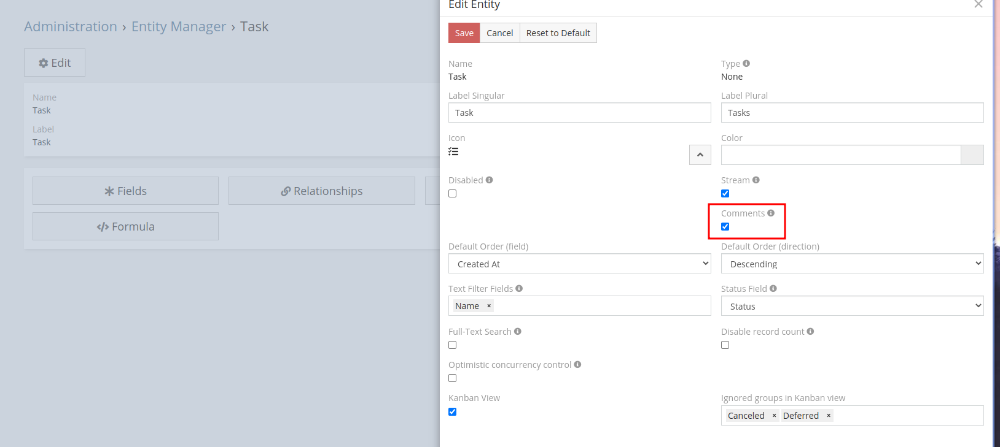
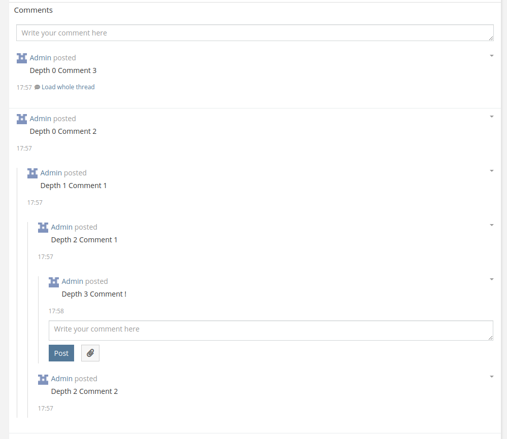

# Module - Comments (Discussions)

Comments extension make it possible to add collapsable comment threads to any entity.

## Table of Contents

* [About](#about)
    * [Features](#features)
    * [Enabling comments for entity](#enabling-comments-for-entity)
    * [Gallery](#gallery)
* [Requires](#requires)
* [Installation](#installation)
    * [Pre-build extension release](#pre-build-extension-release)
    * [Build from source](#build-from-source)

## About

### Features

- Comments can be attached to any entity.
- Posting attachments.
- Replying.
- Comment moderation - editing and removing.
- Collapsed thread by default.
- Fast loading.
- ACL check for posting and accessing comments.

### Enabling comments for entity

Go to `Administration > Entity Manager` select entity and click `Edit` button.
Then check `Comments` checkbox.



### Gallery



## Requires

- EspoCRM >= 7.0.0
- PHP >= 8.0
- Depends on [Autocrm](https://gitlab.apertia.cz/autocrm/modules/autocrm) module.

## Installation

### Pre-build extension release

1. Download the latest release from [Release page](https://github.com/mozkomor05/espocrm-comments-extension/releases/latest).
2. Go to **Administration** -> **Extensions** and upload the downloaded file.

### Build from source

1. Make sure than `node`, `npm` and `composer` are installed.
2. Clone the repository.
3. Run `npm install`.
4. Run `grunt package`. This will create a `dist` folder with the final extension package..

#### Deploying

Optionally you can create a `.env` file based on the `.env.template` file. The `.env` file will be used to deploy the
extension to an existing EspoCRM installation.

**Linux example**

```shell
mv .env.template .env
vim .env # edit the file
grunt deploy # deploy the extension
```
